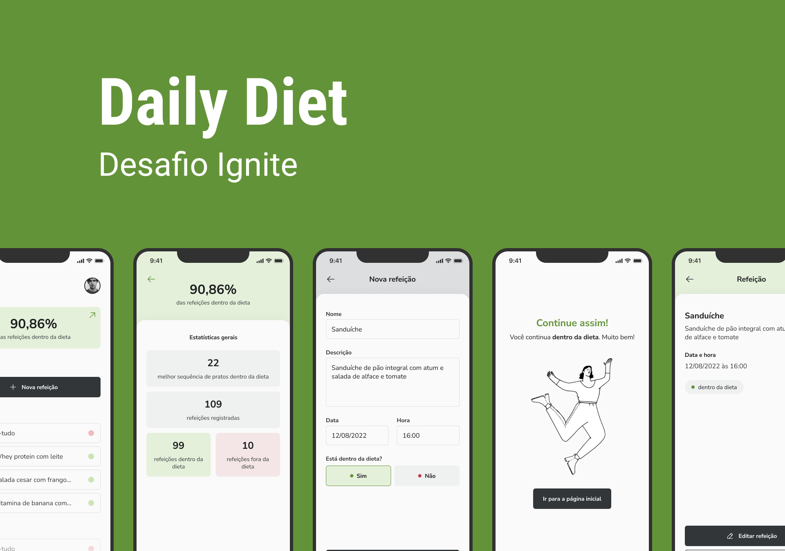

<!-- markdownlint-disable MD033 -->
<!-- markdownlint-disable MD041 -->

<div align="center">
   <a href="https://github.com/mgckaled">
      
   </a>
   
   
   <a href="https://github.com/mgckaled/ignite-reactnative_dailydiet/commits/main">
      
   </a>
   
  
</div>

<br>

<div align="center">
  <a>
     
     
     
     

  <a/>
</div>

<br>

# React Native - Daily Diet

<div align="center">

[**Sobre o Desafio**](#sobre-o-desafio) &nbsp;&nbsp;**•**&nbsp;&nbsp;
[**Layout**](#layout) &nbsp;&nbsp;**•**&nbsp;&nbsp;
[**Configurações**](#configurações) &nbsp;&nbsp;**•**&nbsp;&nbsp;
[**Tecnologias**](#tecnologias) &nbsp;&nbsp;**•**&nbsp;&nbsp;
[**Licença**](#licença)&nbsp;&nbsp;**•**&nbsp;&nbsp;
[**Autor**](#autor)

</div>


<br>

## Sobre o Desafio

Nesse desafio, será desenvolvido uma aplicação de cadastro de refeições, que contém as seguintes funcionalidades:

- Adicionar uma nova refeição
- Editar uma refeição
- Remover uma refeição da listagem
- Mostrar as estatísticas do progresso da dieta
- Navegação entre telas em pilha
- Armazenamento local das refeições

Apesar de serem poucas funcionalidades, serão utilizados conceitos como:

- Estados
- Imutabilidade do estado
- Listas e chaves no React Native
- Propriedades
- Componentização
- Parâmetros de navegação

## Layout

O layout das telas da aplicação **Daily Diet** foi desenvolvido pela equipe da **Rocketseat** através da ferramenta [**Figma**](https://www.figma.com).
Você pode acessar o layout através deste link: [**Daily Diet**](https://www.figma.com/file/dZzJ6Nm8eMFfBs0R9jnbLK).

## Configurações

Necessário realizar as seguintes instalações:

- [Git](https://git-scm.com/)
- [npm](https://www.npmjs.com/)
- [Node](https://nodejs.org/)
- [Expo](https://docs.expo.dev/)
- [Expo Go](https://expo.dev/client) (Android ou IOS)

Criar conta e configurar os serviços externos:

- [GitHub](https://github.com/)
- [Expo](https://expo.dev/)

Clonar repositório:

```bash
# Execute o comando git clone para realizar o clone do repositório
$ git clone https://github.com/mgkclaed/ignite-reactnative_dailydiet.git
# ou execute
$ gh repo clone mgckaled/ignite-reactnative_dailydiet
# Entre na pasta do repositório clonado
$ cd ignite-reactnative_dailydiet
```

Dependências e inicialização:

```bash
## instalar dependências
$ npm i
# inicializar expo
$ npx expo start
```

Configurações Expo:

```bash
# após criar uma conta no Expo, faça login pelo terminal:
$ npx expo login
# confirme seu nome e senha
# confirmar login. O terminal deverá mostrar o nome do usuário
$ npx expo whoami
```

## Tecnologias

- [React Native](https://reactnative.dev/)
- [TypeScript](https://www.typescriptlang.org/)
- [Expo](https://expo.dev/)
- [NativeBase](https://nativebase.io/)

## Licença

Distribuído sob a licença **_MIT_**. Veja [LICENSE](LICENSE) para mais informações.

## Autor

Feito por Marcel Kaled. Entre em contato!

---

<h5 align="center">
  &copy;2022 - <a href="https://github.com/mgckaled/">Marcel Kaled</a>
</h5>
